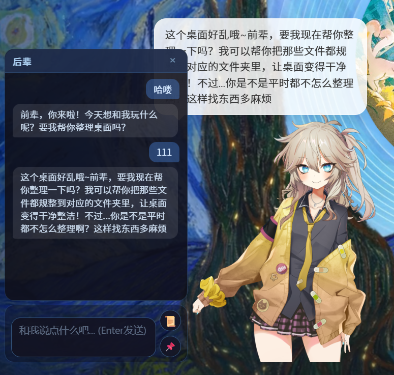

<div align="center">

# 🐾 Live2DPet AI Assistant

**一款结合了 Live2D 动态渲染与大模型视觉理解的次世代桌面宠物**

*透明视窗 · 无缝穿透 · 智能感知 · UI 玻璃拟态*

</div>

---

## ✨ 项目简介与特性

**本项目由Antigravity/Trae纯AI开发**

Live2DPet 是一个基于 Electron 与 PixiJS 构建的原生桌面引擎，它不仅仅是一个能在屏幕上走动卖萌的 Live2D 纸片人，更是一个**拥有“视觉”的 AI 助手**。



核心亮点特性包括：
- 🪟 **极限视窗管理**：无边框窗口 + 硬件级背景透明。独创的 DOM 阻挡（Hitbox）算法，完美实现“悬浮在桌面上方且不阻挡底层软件鼠标操作”的交互悖论。支持托盘一键开启“全局穿透”。
- 🎭 **超平滑 Live2D 渲染**：基于 PixiJS v7 的高性能 WebGL 渲染管线，视线会自然跟随鼠标光标移动。
- 👁️ **大模型多模态视觉交互**：自动捕捉当前桌面屏幕截图 -> 在底层 C++ 内存极限转化为高质量轻量级 JPEG -> 推送至视觉分析大模型，实现对你当前显示器内容的智能吐槽与对话。
- 🧠 **滑动窗口记忆增强**：不仅是一问一答，桌宠能够根据用户配置，记录保存最近的对话上下文，让交流更具连贯性。可选“无痕潜行模式”隐藏被动生成的截图对话。
- 🖱️ **高级 UX/UI 体验**：悬停防抖、全局图钉📌常驻控制、完美修复的高分屏拖拽引擎与防死锁设计，专门设计的滚动条与毛玻璃效果（Glassmorphism），完全不逊色于专业级桌面应用的 UI 质感。
- 🛡️ **极度强健的鼠标物理防穿透机制**：解决 Electron 透明与各种面板间的逻辑冲突，保证左键拖拽、右键菜单在任意复杂交互下都不会出现界面死锁或事件穿透失败。

---

## 🛠️ 核心技术栈说明

为确保图形渲染与原生系统交互的极致稳定，本项目锁死了部分核心依赖版本：

| 技术框架/库 | 版本/要求 | 核心架构职责 |
| :--- | :--- | :--- |
| **Electron** | `^20.x`+ | 提供跨平台封装、无边框透明窗口、主进程原生屏幕捕获 API（`desktopCapturer`）。 |
| **Node.js** | 随 Electron | 提供 `path`、`fs` 及 `zlib` 等底层模块。托盘图标纯靠 `zlib` 程序化生成真透明 PNG，告别冗余资产。 |
| **PixiJS** | `v7` | 最顶级的 HTML5 2D WebGL 渲染引擎。**为何锁死 v7？** 因为 v8 对事件树进行了破坏性重构，会导致老牌模型插件失效。 |
| **pixi-live2d-display** | 匹配 PixiJS v7 | Live2D 领域的王者加载器。处理了繁杂的 `.model3.json` 贴图绑定与动态库初始化。 |
| **大语言模型 API** | SiliconFlow / OpenAI SDK | 将截屏图像数据发送到云端。通过 `fetch` 直连，配合 `temperature` 和 `max_tokens` 实现人格定制。 |

---

## 🏗️ 项目架构解析

本项目采用了经典的 **[Main Process 主进程] <-> [Renderer Process 渲染进程]** 双层架构，做到了职责的绝对隔离。

### 💻 主进程 (`main.js`)
- **窗口守护者**：控制 `BrowserWindow` 的透明度、尺寸锁死与 DPI 适配。
- **系统层控制**：维护 System Tray 托盘菜单（显示、隐藏、开发者工具、退出）。
- **截屏与压缩中心**：接收渲染进程指令，调用原生的 `desktopCapturer`。使用底层的 `.resize()` 和 `.toJPEG(80)`，将几十兆的纯无损 PNG 截屏暴力降维至几百 KB，**彻底解决网络 400 Bad Request 崩溃噩梦**。

### 🎨 渲染进程 (`index.html` & `pet-app.js`)
- **DOM Hitbox 物理碰撞**：摒弃有缺陷的 PixiJS 原生事件隔离，在最顶层绘制悬空 `div#hitbox` 控制鼠标。配合防抖延迟 200ms 防断触，决定何时 `disable-mouse-events`（穿透回桌面桌面）。
- **动效处理层**：气泡浮现、毛玻璃配置面板滑出、聊天输入框的焦点保护。
- **AI 大脑与记忆**：通过 `localStorage` 维护 API Key。在发包前注入 `system` 人设，铺排最近聊天的纯文本 `messages`，并在最后一帧塞入最新的屏幕截图，发送 Fetch 请求。

---

## 🚀 如何运行与调试

### 环境要求
- Node.js (推荐 v16+ 或 v18 LTS)
- NPM

### 启动步骤

1. **克隆并安装依赖**
   ```bash
   npm install
   ```
2. **启动应用**
   ```bash
   npm start
   ```
3. **打开调试工具 (DevTools)**
   桌面右下角系统托盘中会出现一个**淡蓝色的圆点图标**（Live2DPet 托盘程序）。右键点击该图标，选择 **"切换开发者工具"** 即可弹出分离式的调试窗口。

---

## 🎮 使用说明

1. **互动与模式切换**：
   直接用鼠标左键按住模型进行平移。可通过右下角托盘菜单勾线开启 **"开启鼠标穿透"**，实现模型挂机无阻碍。
2. **主动聊天与全自由度面板**：
   将鼠标**悬停**在模型附近约 0.5 秒，脚下会浮现输入框面板。**按住输入框的面板底板和边框，您可以将聊天界面自由拖拽到屏幕任何位置！**。
   点击 📌 图标可将输入面板全局常驻桌面。键入内容并敲击 **Enter回车** 即可向大模型发送消息。
3. **右键拉出“大脑”**：
   在宠物身上点击 **右键**，随时滑出悬浮设置面板。你可以在里面填写/设置：
   - 模型服务商的 Base URL 和 API Key，并可通过下方的 **"📡 测试 API 连接"** 按钮即刻排错。
   - 配置“主动扫描屏幕”的频率和 Token 上限。
   - **🧠 灵魂配置**：自定义大模型的主人称呼（会同步显示在聊天窗头部）与底层人格（System Prompt）。
    - 可选开启“滚动窗口记忆”，以及**“隐藏自动截屏的聊天记录”**（潜行模式：让被动产生的吐槽不出现在的您的历史聊天面板干扰阅读，保持纯净）。
   配置完毕后点击“保存并应用”，面板立刻收起，数据将持久化保存在本地。

---

## 📅 近期更新与修复日志

- **交互体验重构**：大幅优化鼠标进出判定防抖。将气泡显示延迟调整至恰到好处，并补齐了悬浮对话框底层的 CSS `pointer-events` 与 `opacity` 过渡。
- **拖拽与穿透防死锁**：彻底重写了 Electron `ignore-mouse-events` 的触发时机。加入严格的 `isDraggingModel` 锁与 `isSettingsOpen` 锁，确保模型在疯狂拖拽、频繁右键或多面板切换时，绝对不会陷入点击穿透或交互卡死的绝境。
- **配置项优化**：默认称呼变更为“前辈”，修复了所有系统底层的按键冒泡冲突。新增项目 `.gitignore` 保护本地资产。
